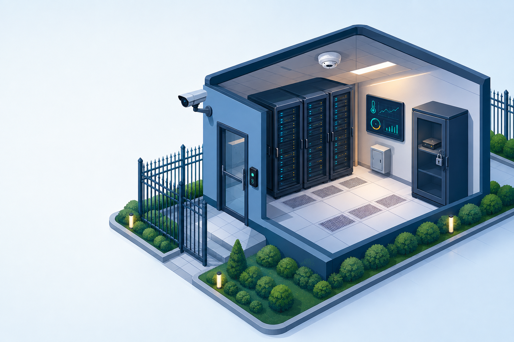

# Aula 03 — Segurança Física

Esta aula apresenta a proteção física como parte essencial da segurança de redes de computadores. O objetivo é compreender como ambientes, pessoas, equipamentos e mídias precisam ser protegidos junto com os controles lógicos.

## Conteúdo abordado

- Controle e formalização de acesso a áreas sensíveis.
- Barreiras, perímetros, cartões, fechaduras, catracas e biometria.
- Controles preventivos, detectivos e de redução de impacto, como CFTV, alarmes, incêndio, energia e climatização.
- Riscos físicos: furto, sabotagem, acesso indevido e perda de mídias.
- Localização do CPD e camadas concêntricas de segurança.
- Procedimentos operacionais para acesso, energia, incêndio, equipamentos e mídias.
- Proteção de mídias contra calor, poluição e campos magnéticos.

## Material da aula

- [TISRC — Tópico 3 — Conteúdo](TISRC-TÓPICO3-CONTEÚDO.pdf)

## Como usar as atividades

1. Abra a interface da atividade escolhida no Windows PowerShell 5.1.
2. Mantenha o arquivo de exemplo selecionado ou escolha outro arquivo CSV compatível.
3. Clique no botão principal da tela.
4. Leia o resultado didático e use o botão Abrir roteiro quando quiser consultar a explicação completa.

Todas as atividades usam dados fictícios, analisam arquivos locais e não controlam câmeras, alarmes, fechaduras, catracas, redes ou equipamentos reais.

## Interfaces das atividades

| Atividade | Tema | Interface |
| --- | --- | --- |
| 10 | Auditoria de acessos físicos | [Abrir atividade 10](topico-06-seguranca-fisica/interface-atividade-10-auditoria-controle-acesso.ps1) |
| 11 | Matriz de controles físicos | [Abrir atividade 11](topico-06-seguranca-fisica/interface-atividade-11-matriz-controles-fisicos.ps1) |
| 12 | Avaliação do ambiente do CPD | [Abrir atividade 12](topico-06-seguranca-fisica/interface-atividade-12-avaliacao-ambiente-cpd.ps1) |
| 13 | Auditoria de mídias e transporte | [Abrir atividade 13](topico-06-seguranca-fisica/interface-atividade-13-auditoria-midias.ps1) |
| 14 | Rotina segura do CPD | [Abrir atividade 14](topico-06-seguranca-fisica/interface-atividade-14-rotina-segura-cpd.ps1) |

## Exemplo de abertura

~~~powershell
powershell.exe -NoProfile -ExecutionPolicy Bypass -File ".\Aula 03\topico-06-seguranca-fisica\interface-atividade-10-auditoria-controle-acesso.ps1"
~~~

O parâmetro ExecutionPolicy Bypass vale apenas para a janela iniciada e não altera permanentemente a configuração do computador.

## Organização

- [Tópico 06 — Segurança Física](topico-06-seguranca-fisica/README.md): roteiros, interfaces e dados sintéticos.
- assets: ilustração didática usada nas interfaces.
- topico-06-seguranca-fisica/resultado: relatórios criados durante os laboratórios. Essa pasta é criada automaticamente e não é versionada.
